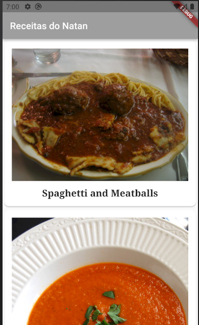
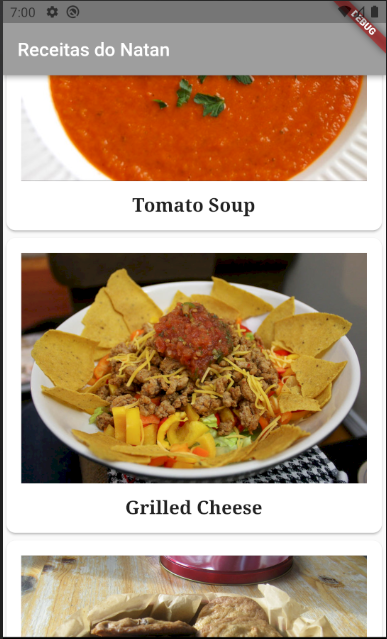
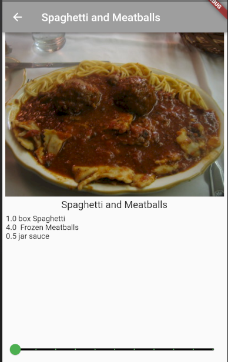

<h1> Projeto de receitas em Flutter <h1> 

  > Status: Concluido ✔️
  
  ### Primeiro projeto finalizado em flutter utilizando o livro disponibilizado pela Google. Esse projeto é uma lista com várias receitas e clicando nelas você consegue ver os seus devidos ingredientes e também pode alterá los de acordo com a quantidade de porções.
  
   
  
  <strong>Principais caracteristicas do projeto: </strong>
  
  + Imagens
  + Listas 
  + Páginas que podem retornar sem dar problemas
  + Alinhamento 
  + Uso de vários widgets diferentes
  
  <strong>Tecnologias usadas: </strong>
   + Flutter
  
  
   ### Imagens do projeto
   
  
&nbsp;&nbsp;&nbsp;&nbsp;&nbsp;&nbsp;&nbsp;&nbsp;&nbsp;&nbsp;&nbsp;&nbsp;&nbsp;&nbsp;&nbsp;&nbsp;&nbsp;&nbsp;&nbsp;&nbsp;&nbsp;&nbsp;&nbsp;&nbsp;  
  
   
  
&nbsp;&nbsp;&nbsp;&nbsp;&nbsp;&nbsp; &nbsp;&nbsp;&nbsp;&nbsp;&nbsp;&nbsp;&nbsp;&nbsp;&nbsp;&nbsp;&nbsp;&nbsp;&nbsp;&nbsp;&nbsp;&nbsp;&nbsp;&nbsp;.png) 
